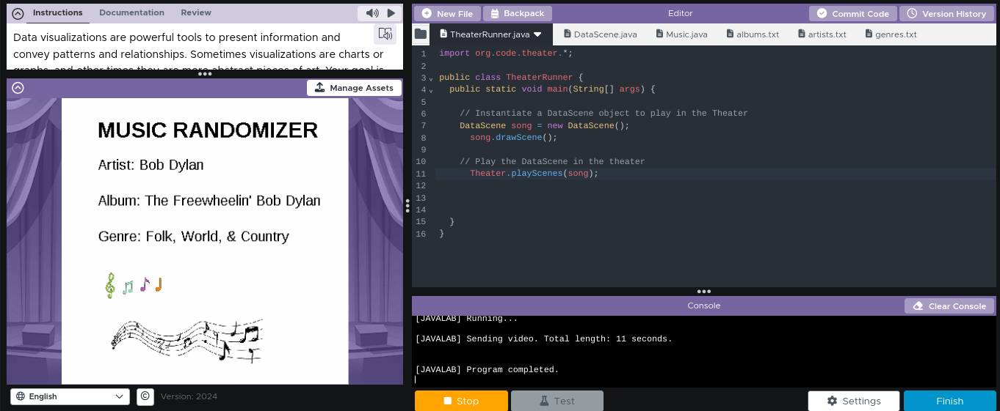

# Unit 4 - Abstract Art Project

## Introduction

Data visualizations are powerful tools to present information and convey patterns and relationships. Sometimes visualizations are charts or graphs, and other times they are more abstract pieces of art. Your goal is to create a visual representation relating at least two categories from your dataset that engages your viewer and encourages them to learn more about your chosen topic.

## Requirements

Use your knowledge of object-oriented programming, one-dimensional (1D) arrays, and algorithms to create your data visualization program:

- **Create at least two 1D arrays** – Create at least two 1D arrays to store the data that will make up your visualization.
- **Implement one or more algorithms** – Implement one or more algorithms that use two-way or multi-selection statements with compound Boolean expressions to analyze the data.
- **Use methods in the Math class** – Use one or more methods in the Math class in your program, such as to perform calculations on the values in your dataset and display the results, choose random values from the dataset, or display images or shapes at random locations.
- **Create a visualization** – Create an image or animation that conveys the story of the data by illustrating the patterns or relationships in the data.
  Note: This may be abstract! Others do not necessarily need to know what the story or pattern is right away, but you do need to be able to explain it to them.
- **Document your code** – Use comments to explain the purpose of the methods and code segments and note any preconditions and postconditions.

## Dataset

Dataset: https://docs.google.com/spreadsheets/d/1aqvHJdMnM0yebIAZ8XCi8e2YHepoC26SnW1_TxhoDuU/edit?gid=1915727116#gid=1915727116 

- **Album** (String) - name of the Album Cover
- **Artist** (String) - name of artist who published the music
- **Genre** (String) - name of the specific genre of the music

## UML Diagram

 UML Diagram-3.png>)

## Video Demo

[[Abstract Art Project Demo]](https://youtu.be/LOnmyCv2-p4)

## Description

This project puts together a music randomizer to allow users the convience of being able to recieve a random artist, album, and genre, all at the same time, in which they correspond to each other. Along with a soothing and peaceful in the background, it aims to keep the user entertained and content, while also providing them information. This project utilizes two 1-D Arrays, which allows it to store data that makes up the visualization. It also includes String Methods and algorithms in which capture multi-selection statements with compound Boolean expressions to analyze the data. Overall, users of this project are able to have access to up to 500 different albums, artists, and genres, intaking new ideas on their own music taste.